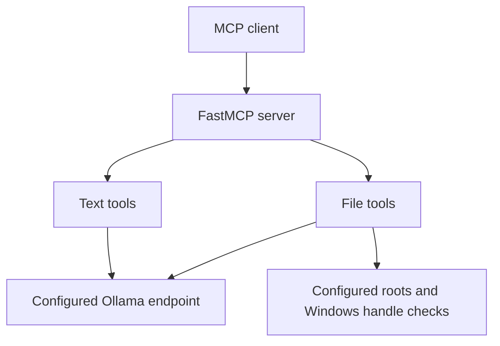

# Local model MCP

[](https://github.com/johnaadams122/local-model-mcp/actions/workflows/ci.yml)

A standalone FastMCP server for summarization, classification and structured extraction through Ollama. Text and file-path tools have independent model controls; file reads require explicit roots.

## Architecture



## Setup

Requirements: Windows 10 or 11 and Python 3.11 or newer (CI uses Python 3.13 on Windows Server 2022; Node 24 is used only by the CI helper scripts, not at runtime). For real use you also need [Ollama](https://ollama.com) running locally with the two default models pulled. Running the full test suite also needs symbolic-link creation rights (Developer Mode or an elevated shell) and a temporary folder on an NTFS volume; see [Tests](#tests).

```powershell
ollama pull gemma4:12b-it-qat
ollama pull qwen2.5:7b
py -3 -m venv .venv
& ./.venv/Scripts/python.exe -m pip install ".[test]"
New-Item -ItemType Directory -Force ./samples | Out-Null
$env:LOCAL_LLM_FILE_ROOT = (Resolve-Path ./samples).Path
& ./.venv/Scripts/python.exe server.py
```

The `py` launcher creates the virtual environment because a bare `python` on Windows can resolve to the Microsoft Store stub or an unrelated global interpreter; if it is not installed, use the full path to a Python 3.11 or newer interpreter. Every later command uses the venv's own interpreter. The server speaks MCP over stdio, so it waits silently for a client. Register it in your MCP client as a stdio server whose command is the venv's `python.exe` with `server.py` as the argument, and set `LOCAL_LLM_FILE_ROOT` (or `LOCAL_LLM_FILE_ROOTS`) in that server entry's environment. Keep the samples folder narrow: no file roots are granted by default. Tests use mocks and need neither Ollama nor the models.

## Synthetic example

Synthetic text input: `classify("Example backlog task", ["task", "reference"])`. A valid response has a selected `label` and bounded `confidence`. This illustrates the interface; output depends on the configured model.

## Tests

```powershell
& ./.venv/Scripts/python.exe -m pytest tests -q
```

Some file-tool tests create real Windows links in temporary folders: symbolic
links, which need Developer Mode (Settings > System > For developers) or an
elevated shell, and NTFS junctions and hard links, which need the temporary
folder on an NTFS volume. These tests fail rather than skip when a link cannot
be created, so run the suite where both are available.

CI executes the same full selected tests directory after the declared fresh-environment dependency setup.

The documented suite uses synthetic data and mocks external services. Dependency
installation may use public package registries; tests are reviewed to run offline.
The CI badge reports the hosted workflow's status for its selected commit.

## External services

Ollama is a runtime dependency. The default endpoint is localhost and can be changed with `LOCAL_LLM_OLLAMA_URL`. Requests are sent with redirects disabled, so an endpoint that answers with a redirect produces an error instead of receiving the prompt at another address. Root containment does not redact model inputs or outputs. Review the endpoint and configured roots before use.

## Limitations

File tools use Windows handle APIs. Authorization covers the opened file path and refuses hard links; it does not recognize secret content inside an allowed root. Summaries, quoted excerpts and extracted fields can reproduce source content. File and text content is passed to the model without a prompt fence, so it can steer the output (see the file tool boundary section). Model output, including extracted fields that pass the presence check, is not guaranteed correct. The triage loop is an optional local utility, configured from `loops/config.example.json`; scheduler, production config and logs are excluded.

## How this was built

The project owner designed the architecture, wrote specifications, directed AI coding agents,
and used AI reviewers plus his own review of designs, plans and results. The code
was developed with AI assistance and review gates.

## License and security

MIT. See [LICENSE](LICENSE) and [SECURITY.md](SECURITY.md).

## Tools

### summarize(text: str, max_words: int) -> str
Asks the model for a summary of `text` in at most `max_words` words and returns
the model's reply as-is (surrounding whitespace stripped). The length is a
request, not enforced: the reply is not truncated or word-counted.
Raises `ValueError` if `max_words` is not positive.

### classify(text: str, categories: list[str]) -> dict
Classify `text` into exactly one of `categories`. Returns
`{"label": <category>, "confidence": <float 0.0-1.0>}`. The label is normalized
to the exact matching category string (matching is case-insensitive). Raises
`ValueError` if `categories` is empty or the model output does not match any
valid category.

### extract_json(text: str, schema: dict) -> dict
Extract structured fields from `text` and return them as a validated dict.

Schema contract: `schema` is a dict mapping each field name to a JSON type name
string. Allowed type names:

| type name | python type |
|-----------|-------------|
| string    | str         |
| integer   | int         |
| number    | float       |
| boolean   | bool        |
| array     | list        |
| object    | dict        |

All fields are required. Any string is accepted as a field name, including names
with a leading underscore or names such as `model_config` or `schema`, and the
returned dict uses exactly the names you supplied. The schema is turned into a
pydantic model used to validate the model output. The tool calls the model up to twice (initial
attempt plus one retry with a stricter reminder). An unknown type name raises
`ValueError`; failing both attempts raises `ValueError` with the last raw model
output (truncated to 500 chars).

### summarize_file(path: str, max_words: int) -> dict
Summarize a file on-box. The response can include source text through the
summary and selected excerpts. Returns the summary, mechanically computed line/byte
counts, and `notable_lines` (severity-regex hits quoted verbatim with line
numbers). `coverage` is `FULL`, or a loud `PARTIAL` marker if the wall-time
budget cut processing short. Reads are confined to the roots in
[the boundary section](#file-tool-boundary).

### extract_json_file(path: str, schema: dict) -> dict
Extract schema fields from a file on-box, same schema contract as
`extract_json` (the same type names, the same pydantic validation of the model's raw reply, and the same two attempts). Strings and numbers then get a substring-presence check: each one in
a field's value, including inside arrays and objects, must occur as a substring
of the source text after both are normalized (case, whitespace, commas and `$`
are ignored), and a field where one does not is NULLED and listed in
`unverified_fields`. This catches a value that appears nowhere in the file. It
does not show that the value is correct. A short value can match inside a longer
one (12 passes against "Total 1200"), an empty or whitespace-only string passes,
a value can come from the wrong place in the file and sit under the wrong field,
dictionary keys are not checked, and a number the model reformats (1200.0 for
1200) fails. Booleans (and nulls) are not checked against the source; they are
returned as the model gave them. Treat extracted fields as a draft to verify.

The result is an object with five keys: `label` (a notice that the output is an unverified local-model digest), `path` (the resolved path of the file that was read), `fields`, `unverified_fields` (the names of the nulled fields) and `note` (an explanation when any field was nulled, otherwise an empty string). Because pydantic validates the raw reply before the presence check runs, `fields` always had the declared types at validation time, but nulling happens afterwards. A nulled field is `None`, so the returned `fields` is not guaranteed to satisfy the declared schema. Check `unverified_fields` before using a value.
The file text must fit in one chunk (a 12000-character cap, so no multi-chunk
extraction): the model is asked once, with at most one validation retry, as for
`extract_json`.

## Model

Two independent environment variables select the models. Each one controls only
the tools listed beside it.

| variable | default | tools |
|---|---|---|
| LOCAL_LLM_MODEL | gemma4:12b-it-qat | summarize, classify, extract_json |
| LOCAL_LLM_FILE_MODEL | qwen2.5:7b | summarize_file, extract_json_file |

Calls use a non-streaming POST to `http://localhost:11434/api/generate` by default;
`LOCAL_LLM_OLLAMA_URL` can override that endpoint.

### Rollback

To run every tool on `gemma4:12b-it-qat` (for example when the smaller file model
is not installed), set both `LOCAL_LLM_MODEL` and `LOCAL_LLM_FILE_MODEL` to
`gemma4:12b-it-qat`. Because each variable affects only its own tools, setting
just one of them leaves the other tools on their default model.

## File tool boundary

`summarize_file` and `extract_json_file` read only beneath explicitly configured roots. Set `LOCAL_LLM_FILE_ROOTS` to a list of absolute folders separated by the operating system's path separator, which on Windows is a semicolon (`os.pathsep`), or use the one-root `LOCAL_LLM_FILE_ROOT` setting, which is never split. For example, two roots in PowerShell:

```powershell
$env:LOCAL_LLM_FILE_ROOTS = "C:\samples;C:\notes"
```

The settings are read once, when the server process starts, so restart the server after changing them. No roots are granted by default. The rules, as implemented:

- `LOCAL_LLM_FILE_ROOTS` wins over `LOCAL_LLM_FILE_ROOT` whenever it is present, even if it is blank or every entry in it is invalid; the single-root setting is then not consulted.
- Entries are trimmed and empty entries are skipped. An entry that is not an absolute path, that does not exist, or that is a file rather than a directory is dropped with a warning on the server's standard error. The remaining valid entries still apply.
- If no usable root is left (neither variable is set, the variable is blank, or every entry was dropped), the server still starts, and every call to `summarize_file` or `extract_json_file` is refused with an error saying no usable allowlist roots are configured. So the failure is reported at the file-tool call, with the per-entry warnings written at startup.

Containment is two-tier: a case-insensitive pre-open filter rejects obvious misses, while authorization checks the final path of the opened handle. Junctions and symlinks that escape a root, hard-linked files and files over the size limit are refused. The size limit is 384000 bytes by default; the `LOCAL_LLM_FILE_MAX_BYTES` environment variable overrides it (set it before starting the server), and the same value also bounds a DOCX member's size and its extracted text. A DOCX is refused when its word/document.xml member declares a DTD. Members ending in `.xml` or `.rels` are screened using archive metadata (compression method, declared size and compression ratio) before decompression, and only STORED and DEFLATED members are accepted; members that are never opened, such as embedded images, are not screened. An unreadable DOCX archive (not a zip, no word/document.xml, a bad CRC) and a word/document.xml that is not well-formed XML, including one that declares an unknown encoding, are reported as a `ValueError`.

The hard-link refusal prevents another name for the same bytes from bypassing a path-based boundary.

**Supported DOCX subset.** Only the body of `word/document.xml` is read, as WordprocessingML in either the Transitional namespace or the Strict OOXML namespace (`http://purl.oclc.org/ooxml/wordprocessingml/main`). A document whose root is in any other namespace is refused with a `ValueError` ("unsupported WordprocessingML namespace") rather than read as empty, and a `.docx` whose body yields no text at all is refused by both file tools and by `extract_docx.py` instead of being summarized as empty content. Text comes from paragraphs (`w:p`) and their text runs (`w:t`), including tables, content controls, hyperlinks, text boxes and tracked insertions; the result is one line per paragraph. Within a run, a tab (`w:tab`, `w:ptab`) is returned as a tab character, a line break or carriage return (`w:br`, `w:cr`) as a newline, and a no-break hyphen as `-`, so words and numbers stay separated. When a text box appears in `mc:AlternateContent`, only one rendering is read (the first `mc:Choice`, or the first `mc:Fallback` if there is no choice), so it is not extracted twice. Not extracted: symbol characters (`w:sym`), text of tracked deletions (`w:delText`), field codes, headers, footers, footnotes, endnotes and comments (those archive members are never opened), and images, charts and embedded objects. Treat the result as the main body text only.

The handle check was tested against a file symlink, a directory symlink and a directory junction that point out of a root (all refused), and against a race: a directory inside a root was replaced by a junction to an outside folder after the early path check, so the file was opened through the junction, and the real directory was put back before the final check. The read was still refused, because the final path of the already-open handle named the outside file even though the restored path name looked legitimate. It was not tested against volume mount points, subst drives or remote SMB shares, so do not rely on the boundary for those; keep roots on ordinary local folders.

File text is placed into the model prompt as-is, without a fence or escaping, so text inside a file can try to steer the model. A file inside an allowed root can therefore change a summary or an extracted value. This is a residual risk that has not been designed away. Summaries are labeled `UNVERIFIED-DIGEST`, `extract_json_file` checks only that a value is present in the source, and the text tools (`summarize`, `classify`, `extract_json`) take their input the same way. Only read files you would be willing to have steer the output, and verify anything you act on against the source.

Configure narrow roots that exclude credential stores, token files and keyrings. Containment grants access to eligible files beneath the configured roots; it does not identify credential material inside those roots.

The file-reading module uses Windows handle APIs and is Windows-only. Configure roots before starting the server.
